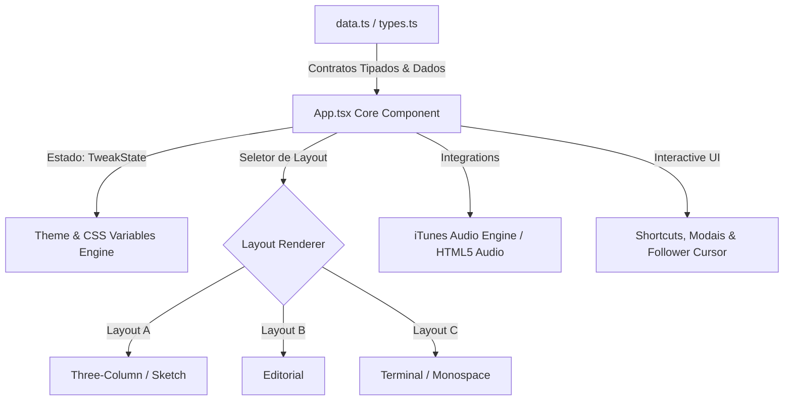

# ⚡ Portfolio Web — Luís Martins

> Repositório do meu portfólio web pessoal, disponível online em **[luismartins.website](https://luismartins.website)**.

Este documento detalha a **arquitetura de software**, **decisões de design** e **escolhas de engenharia** adotadas no desenvolvimento da aplicação.

---

## 📐 1. Visão Geral da Arquitetura

O projeto foi concebido como uma **Single Page Application (SPA)** reativa, leve e de alta performance, utilizando **React 19**, **TypeScript** e **Vite 6**. 

A arquitetura orientou-se por três pilares fundamentais:
1. **Separação Estrita de Dados e Apresentação (Data-Driven SPA)**.
2. **Motor de Estilos Baseado em Variáveis CSS Nativas (Zero Runtime Overhead)**.
3. **Multi-Layout Reconfigurável em Tempo Real**.



---

## 🎨 2. Sistema de Design: Engenharia Neo-Brutalista

A escolha da estética **Neo-Brutalista** não foi apenas visual, mas sim uma decisão funcional de engenharia de interface:

- **Alto Contraste e Tipografia Funcional**: Utilização de `Space Grotesk` (sem serifa, geométrica) para títulos e `JetBrains Mono` (monoespaçada) para metadados, código e elementos de comando.
- **Estrutura de Linhas e Bordas Explícitas**: Elementos delimitados por bordas diretas (`1px solid var(--fg)` ou `var(--rule)`), reduzindo a necessidade de sombras complexas (*box-shadows*) e otimizando a aceleração de GPU no *compositing* do navegador.

### Motor de Temas via Variáveis CSS (`index.css`)
Em vez de utilizar bibliotecas CSS-in-JS (como styled-components) ou frameworks pesados de utilitários que recalculam estilos em JS durante a execução, o tema foi construído sobre **CSS Custom Properties**:

```css
:root {
  --bg: #ffffff;
  --fg: #2a2a2a;
  --accent: #0000ee;
  --sans: "Space Grotesk", sans-serif;
  --mono: "JetBrains Mono", monospace;
}

.root.inverted {
  --bg: #141518;
  --fg: #e8e6e1;
}

.root.accent-red   { --accent: #ee0000; }
.root.accent-green { --accent: #00994d; }
```

#### Vantagens Técnicas:
- **Instant Theme Switching**: A alteração da cor de acento ou a alternância para o modo invertido (*dark mode*) é realizada alternando classes no elemento raiz (`.root`), propagando as alterações instantaneamente por toda a árvore DOM sem provocar re-renders computacionais no React.
- **Transição Suave**: Propriedade `transition: background 300ms ease, color 300ms ease;` nativa no browser.

---

## 🔄 3. Motor de Layout Dynamic Switcher

Uma das decisões de arquitetura mais distintivas é a capacidade de alternar a estrutura visual completa do site em tempo real sem perder o estado da aplicação nem recarregar a página.

### As 3 Estruturas de Layout:

1. **Layout A (Three-Column / Sketch)**:
   - **Conceito**: Estrutura em 3 colunas baseada em *rail navigation*.
   - **Disposição**: Linha do tempo/ações à esquerda (`rail-left`), conteúdo principal ao centro e fotografia/destaque à direita (`rail-right`).

2. **Layout B (Editorial)**:
   - **Conceito**: Apresentação de revista / publicação.
   - **Disposição**: Tipografia hero massiva (`name-huge`), imagem assimétrica em destaque e fluxo vertical contínuo de projetos e experiências.

3. **Layout C (Terminal / Monospace)**:
   - **Conceito**: Ambiente de linha de comandos/developer.
   - **Disposição**: Tipografia 100% monoespaçada, delimitadores estilo ASCII (`+---`, `[01]`), estrutura em blocos empilhados com indicador de status dev.

### Implementação Reutilizável:
Os dados e sub-componentes (cartões de projeto, timelines de educação, modal de atalhos) são comuns. O motor de renderização apenas altera os wrappers de grid/flexbox e classes estruturais com base em `tweak.layout ('a' | 'b' | 'c')`.

---

## 📊 4. Gestão de Estado & Fluxo de Dados

### Imutabilidade e Contratos de Tipo (`types.ts` & `data.ts`)
A fonte da verdade para o conteúdo do portfólio está isolada em `data.ts` com tipagem estrita via `types.ts`:

```typescript
export interface ProjectItem {
  n: string;
  title: string;
  year: string;
  kind: string;
  desc: string;
  stack: string[];
  github: string;
}

export interface TweakState {
  layout: "a" | "b" | "c";
  accent: "blue" | "red" | "green" | "black";
  inverted: boolean;
  cursor: boolean;
}
```

### Decisão de Estado Local vs Global
Dado a natureza do portfólio (SPA sem necessidade de sincronização com backend via REST/GraphQL), optou-se por **não utilizar bibliotecas externas de estado (Redux, Zustand, Recoil)**.

- **Estado Reativo**: O estado transient (`tweak`, filtro de pesquisa de projetos, faixa de áudio atual) é gerido na raiz do componente (`App.tsx`) utilizando `useState` e `useRef`.
- **Performance de Renderização**: O agrupamento de controlos de UI num único objeto de estado `TweakState` reduz a fragmentação de atualizações de estado.

---

## 🎵 5. Integração com APIs & Audio Engine

O portfólio inclui um player de áudio integrado com música em segundo plano (faixas do Drake):

### Decisão de Streaming Remoto vs Ativos Locais:
- **Problema**: Armazenar ficheiros `.mp3` no repositório aumentaria drasticamente o tamanho do bundle e o consumo de largura de banda.
- **Solução**: Integração dinâmica com a **iTunes Search API**.

```typescript
// Consulta dinâmica do preview de 30s da faixa via iTunes API
const res = await fetch(`https://itunes.apple.com/search?term=${encodeURIComponent(song.query)}&limit=1&entity=song`);
const data = await res.json();
if (data.results?.[0]?.previewUrl) {
  audioRef.current.src = data.results[0].previewUrl;
  audioRef.current.play();
}
```

- **Vantagens**: zero peso em ficheiros multimédia no build final, streaming direto dos CDN de alta disponibilidade da Apple.

---

## ⚡ 6. Otimização de Performance & Bundling

### Decisões de Dependências (Zero Heavy UI Libraries)
- **Sem Frameworks CSS Adicionais**: Não foram adicionadas dependências pesadas como Tailwind CSS ou UI Component Frameworks (MUI/Antd). Todo o sistema de regras usa CSS puro e moderno (Flexbox, CSS Grid, Custom Properties).
- **Apenas Lucide-React**: Única dependência de UI para ícones vetoriais em árvore tree-shakeable.

### Animações Nativas via CSS Keyframes
As animações de revelação da tipografia (`rise` animation no título) e transições de layout utilizam `@keyframes` nativos e `transform: translateY()`, acionando a composição diretamente na camada de aceleração de hardware do navegador sem *layout thrashing*.

### Deploy & Estratégia de Roteamento (`vercel.json`)
Para garantir o comportamento correto de Single Page Application (SPA) em servidores Edge (Vercel):

```json
{
  "rewrites": [
    {
      "source": "/((?!.*\\..*|api).*)",
      "destination": "/index.html"
    }
  ]
}
```
Isso redireciona todas as solicitações de rotas virtuais para o `index.html`, permitindo tratamentos no lado do cliente sem erros `404 Not Found`.

---

## ⚖️ 7. Matriz de Trade-offs Téchnicos

| Decisão | Opção Escolhida | Alternativa Considerada | Razão / Justificação |
| :--- | :--- | :--- | :--- |
| **Estilização** | CSS Custom Properties | Tailwind CSS / CSS-in-JS | Eliminar overhead de compilação JS e runtime, garantindo trocas de temas instantâneas. |
| **Gestão de Estado** | React State Nativo | Zustand / Redux Toolkit | Reduzir tamanho do bundle JS; a complexidade da app não justifica uma store global externa. |
| **Layouts** | 3 Layouts dinâmicos num só componente core | Rotas separadas (React Router) | Preservar a continuidade da sessão e do áudio em reprodução enquanto o utilizador alterna a visualização. |
| **Áudio** | API iTunes (Previews 30s) | Ficheiros MP3 locais no `/public` | Manter o repositório extremamente leve (< 1MB) e evitar custear tráfego de mídia. |

---

## 💡 Apoio ao Processo de Design & Implementação

> **Nota sobre o processo criativo:**  
> As decisões visuais e a exploração de conceitos estéticos contaram com o apoio do **Claude Design** para consulta e apoio ao design. Todas as decisões de arquitetura, escolha de layouts, engenharia do sistema de temas e a implementação técnica total do projeto foram integralmente orientadas, definidas e executadas por **Luís Martins**.

---

Developed & Architecture by **Luís Martins**

